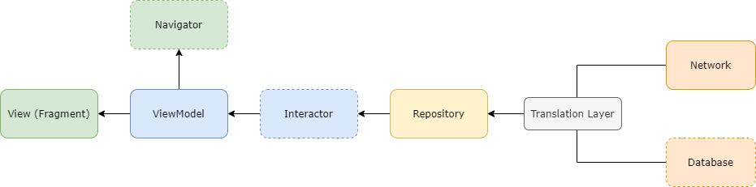

# Bottle Rocket Test Project
I chose an MVVM architecture using RxJava and the Android ViewModel class. I also made use of the Jetpack Navigation Component. For caching, I chose to use OkHttp integrated Cache using the included Etags in the api response.
In addition to the specified requirements, I included the following bonus functionality: 
- Swipe to refresh
- Toolbar search view
- Google maps integration on store details page

### Architecture Diagram

### Library Choices
Some justifications of library choice because everyone has different preferences :)

#### Why RxJava?
  I chose RxJava instead of LiveData because LiveData has kind of a subset of the functionality of RxJava. Similar behavior can be achieved using BehaviorSubject. I chose not to use both to just reduce the number of dependencies needed, because RxJava can achieve all of the functionality I would look for in LiveData.
  I chose RxJava for both aynchronous work and for reactive streams over Coroutines because of the testability. Currently, Coroutine channels in place of Rx Observables are quite difficult to test and can be very messy. Flows in kotlin seem very promising as an Observable replacement, but I have not had time to experiment with them yet so I went with something I was more familiar with because of time constraints.

#### Why Koin? 
  I chose koin instead of Dagger for two reasons. First off would be simplicity. It is much easier to grok for a lot of people (useful if you work with devs who are unfamiliar with DI or Dagger). The second more important reason for me is build speed. Because Koin does not rely on code generation, build speeds are much faster compared to Dagger.

#### Why Moshi? 
 I chose Moshi over alternatives like Gson because of the great kotlin support. It handles default values as well as explicit nullability that kotlin enforces. It also is lighter weight and gives you the choice between code generation and reflection based parsing.
